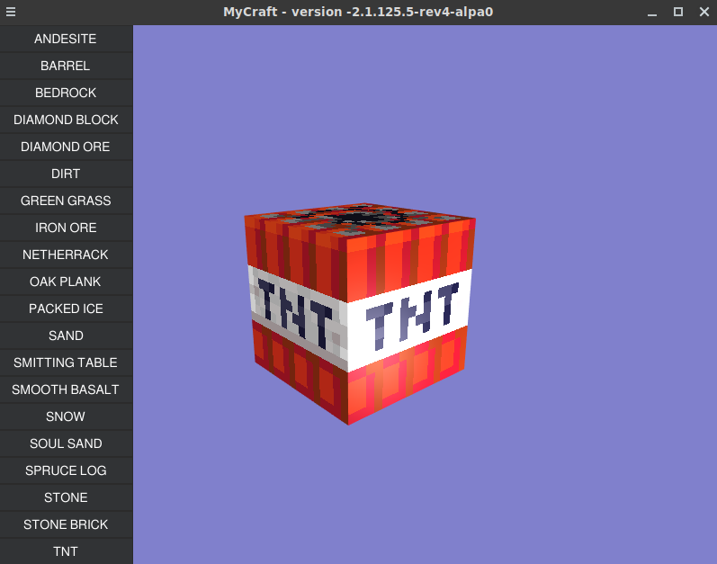

# Mycraft

Currently display some Minecraft blocks




## Setup & run

```
$ sudo apt-get install xorg-dev libgl1-mesa-dev libopenal1 libopenal-dev libvorbis0a libvorbis-dev libvorbisfile3 gcc make
$ make run
```